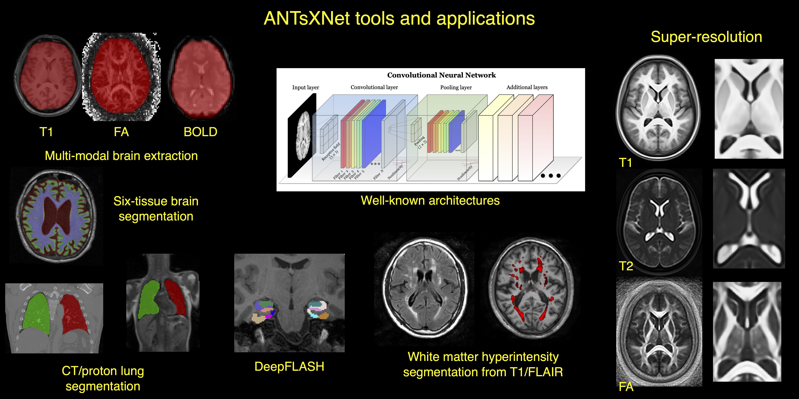

[](https://pypi.org/project/antstorch/)
[](code_of_conduct.md)
[](https://pubmed.ncbi.nlm.nih.gov/33907199/)

# Advanced Normalization Tools for Deep Learning in PyTorch (ANTsTorch)

A collection of deep learning architectures and applications ported to the PyTorch framework and tools for basic medical image processing. ANTsTorch with some cross-compatibility with our Python and R analogs, [ANTsPyNet](https://github.com/ANTsX/ANTsPyNet/) and [ANTsRNet](https://github.com/ANTsX/ANTsRNet/), respectively.  

ANTsTorch provides several high-level features:

- A large collection of common deep learning architectures for medical imaging that can be initialized
- Various pre-trained deep learning models to perform key medical imaging tasks
- Utility functions to improve training and evaluating of deep learning models on medical images
- Normalizing flows

<p align="middle">
  
</p>

## Overview 

<details>
<summary>Installation</summary>

### Binaries

The easiest way to install ANTsTorch is via pip.

```
python -m pip install antstorch
```

### From Source

Alternatively, you can download and install from source.

```
git clone https://github.com/ANTsX/ANTsTorch
cd ANTsTorch
python -m pip install .
```

</details>

<details>
<summary>Applications</summary>

ANTsTorch supports several applications (ANTsPyNet weights):

- Multi-modal brain extraction
  - T1 (brain-only, three-tissue, hemisphere, lobes)
  - T2
  - T2star
  - FA
  - FLAIR
  - MRA
- Cortical thickness estimation
- Deep Atropos (six-tissue brain segmentation)
- Desikan-Killiany-Tourville cortical labeling
- Harvard-Oxford-Atlas labeling
- Deep FLASH
- Cerebellar morphology
- Data augmentation and preprocessing utilities

Other ANTsPyNet ports are a WIP.  

</details>

<details>
<summary>Publications</summary>

See the [ANTsX Ecosystem publications](https://pubmed.ncbi.nlm.nih.gov/33907199/) for background and applications.

</details>

<details><summary>License</summary>

The ANTsTorch package is released under an [Apache License](https://github.com/ANTsX/ANTsTorch/blob/master/LICENSE.md).

</details>

<details>
<summary>Acknowledgements</summary>

- We gratefully acknowledge the grant support of the Office of Naval Research (N0014-23-1-2317).  

</details>

## Other resources

- [ANTsTorch Documentation (coming soon)](https://antsx.github.io/ANTsTorch/)  
- [ANTsTorch self-contained examples](https://gist.github.com/ntustison/12a656a5fc2f6f9c4494c88dc09c5621#antsxnet)  
